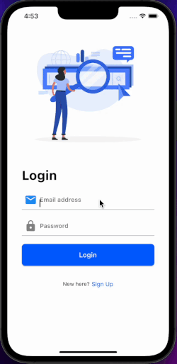

### Flutter Starter

We wanted to take Flutter a step further and accelerate the process of building production-level apps. Presenting our solution- Flutter Starter!

## Introduction:

Flutter Starter, a starter kit for Flutter that helps you bootstrap projects with all the essential modules like **State Management, API calls, Style Guide, Localisation, Routes** etc. It helps you build production ready apps in a jiffy. It handles everything at one place so you don't have to rewrite code.

## What does Flutter Starter provide :

For the initial release flutter starter provides:

1.  **Api- Services** There are two api-services **dio** and **http** that have been set up if you want to provide any network method calls**.** We have set up an example of http in the application for signup/ login purposes but you can choose whatever you are comfortable with.

- **Dio** : It is a powerful Http client for Dart, which supports Interceptors, Global configuration, FormData, Request Cancellation, File downloading, Timeout etc. [here](lib/api_sdk/dio)

- **Http** : It is a composable, Future-based library for making HTTP requests that contains a set of high-level functions and classes that make it easy to consume HTTP resources. [here](lib/api_sdk/http)

2.  **State Management** For state management in the application, BLoC has been set up for basic authentication and updating themes in the app.

- **BLoC :** Flutter bloc is quite **simple** and easy to understand, it has a very good documentation with tons of examples and also, is one of the most used in the flutter community. [here](lib/shared/bloc)

3.  **Basic Set up**

- **Localisation**: If you build an app for different markets, you will most likely need to support multiple languages for your end-users, hence we have added localisation as a basic set up. Right now, 3 languages have been added in our localisation folder but you can add more according to your use case: English, Spanish, French. [here](lib/l10n)

- **Routing** : An app has to display multiple screens depending upon the developer's needs. Hence we need different set of routes to display those screens. We have set up a basic file (routes.dart) in which we are demonstrating how you can set-up routes of your application. We have added **go_router** as a dependency for routing so that same application can be run on flutter_web too, but if you want you can use basic routing as well by just uncommenting the code and using it as per requirements. [here](lib/routes)

- **Themes** : Theme of the whole application will be derived from here. A basic theme set up including interchanging of light and dark theme will be there. You can add n amount of colours, font sizes, text theme, etc to maintain the theme of your application. [here](lib/themes)

- **Test Cases** : We have also introduced test cases in the base setup so that you can validate your UI, business logic, functionality, etc. [here](./integration_test/app_test.dart)

4.  **UI Screens**

- **Sign In :** This will be the landing page of our application, for someone who already has an account registered can login directly. [here](lib/screens/login/login_screen.dart)

- **Sign Up :** You can register yourself here. [here](lib/screens/signup/signup_screen.dart)

- **Home :** It will contain a drawer which will have basic user information who has logged in and a switch to change between light and dark theme. [here](lib/screens/home/home.dart)

## What will Flutter Starter provide in later releases :

For second release we are planning to introduce one more api-service and command line interface.

1.  **Api-Services** :

- **Firebase** : We will be providing all social authentications(Google/Twitter/Facebook etc) to the developer using firebase services.

2.  **State Management** :

- **Provider/Riverpod** : We will be providing support for Provider/Riverpod state management templates too.

3.  **Command Line Interface** : We are aiming to provide a command line interface, so that you can easily create a project using flutter starter as the base template by just writing a command in the terminal.

4.  **Example Templates** : We will creating multiple apps template on how to use this boilerplate.

## How to use flutter starter:

To get started with flutter starter:

[Steps to get started](./use_flutter_starter.md)

## How to Contribute

Thank you for your interest in contributing to Flutter Starter! We are lucky to have you 🙂 Head over to [Contribution Guidelines](https://github.com/GeekyAnts/flutter-starter/blob/master/CONTRIBUTING.md) and learn how you can be a part of a wonderful, growing community.

## License

Licensed under the MIT License, Copyright © 2020 GeekyAnts.

See [LICENSE](https://github.com/GeekyAnts/flutter-starter/blob/master/LICENSE) for more information.
